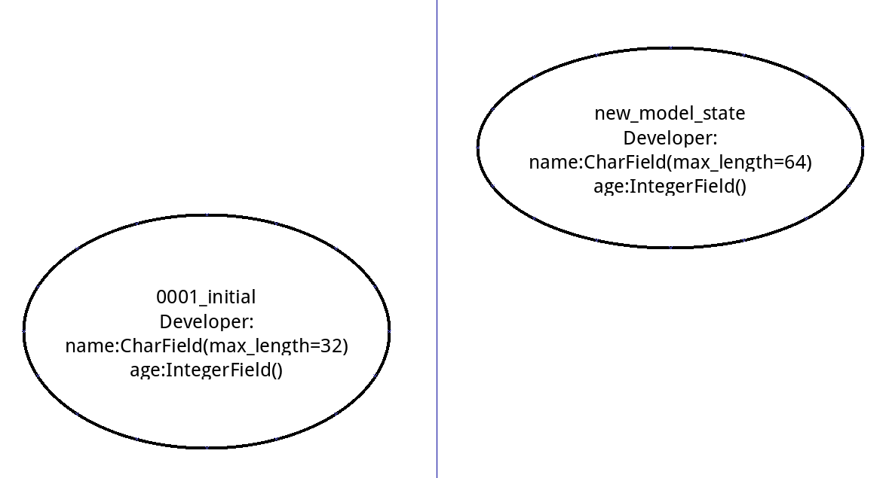
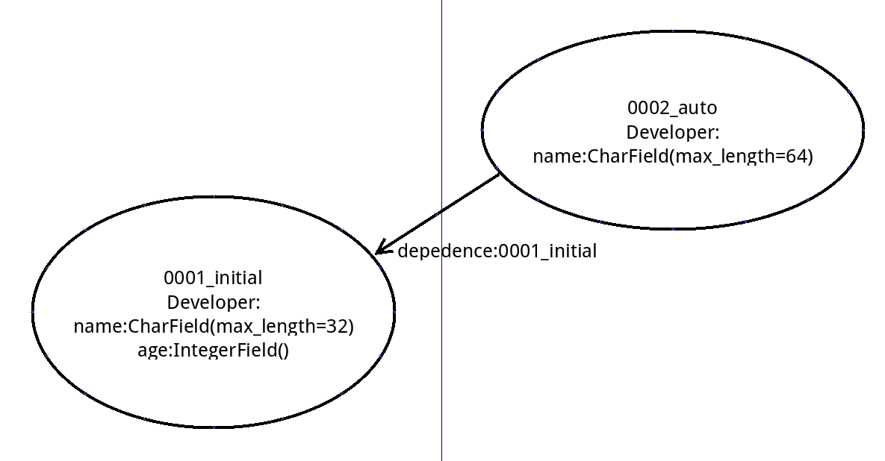

###Migrations 的作用

- 保持数据库与Model的同步

- 对Model的更改可以方便地反映到数据库中，免去了手动写SQL的麻烦

- 方便进行数据的迁移

- 类似于版本控制系统，易于跟踪Model(Schema) 以及对应的历史变化


----

###Migrations Wrokflow

1 新建或更新一个Model

2 *manage.py makemigrations <app_name>* 收集每个app中model的变化并写入migrations文件中

3 *manage.py migrate <app_name> <migration_name>* 执行未执行过的migrations文件(将更改应用到数据库)


###Migrations 如何侦测Model改动

在运行makemigrations命令时，Migrations系统会在个app目录下的migrations目录寻找并导入migrations文件——就是一个个py文件。由于依赖的存在，所以可以方便地以图的形式载入文件。接着，比较图的最新节点和model.py中的定义，得出此次的更改，再将其写入到新的migrations文件里保存。

举栗来说：

现有app下的models.py

```python

class Developer(models.Model):

    name = models.CharField(max_length=32)

    age = models.IntegerField()

```

执行makemigrations会生成0001_initial.py这样的migrations文件（假设没有自定义名字），然后执行migrate在数据库中建立对应的table。接下来修改models.py:

```python

class Developer(models.Model):

    name = models.CharField(max_length=64)  # 假设入职了一个名字很长的维吾尔族人，于是我们的max_length要更改一下

    age = models.IntegerField()

```

运行makemigrations ， 会载入已经存在的**0001_initial.py**，再跟最新的model来比对，用图来表示是这样的：





二者相减，得出model的更改，结果是




之后将0002_auto写入磁盘，就成了**0002_auto_时间.py**。

后面如果再进行更改，这些更改也会像结点一样，加到这个图上来，依赖于前一个结点。


----

###migrate的一些认识

首先看一下migrations文件的构成，拿上面**0001_initial.py**来说，大概长这个样子：

```python

from django.db import migrations, models

class Migration(migrations.Migration):

    dependencies = []

    operations = [

        migrations.AddField("Developer", "name", models.CharField(max_length=32)),

        migrations.AddField("Developer", "age", models.IntegerField()),

    ]

```

dependencies 和 operations是两个相当重要的属性，其中

> * **dependencies** 本migrations文件依赖的其他文件列表

> * **operations** 要进行的操作列表


进行migrate的时候，会和makemigrations一样先把migrations文件都载入，形成图。不过这次不同的是它还会访问数据库，试图寻找各个migrations文件的迁移记录。这些数据会记录在一张叫django_migrations的表中，字段是 migration文件名 + migrate时间。如果有，不再执行对应文件的migrate；如果没有找到记录，说明migration文件未被migrate过，则按照依赖链的关系，从第一个未执行migrate的结点开始migrate，如果成功，则将migration文件名和时间写入django_migrations中，否则，出错……


----

###Custom Migration


有时候需要手动修改数据库表结构或者其他无法用migration实现的schema更改时，可以用custom migration方便地进行修改。

主要依靠**django.db.migrations.RunPython**,  **django.db.migrations.RunSQL** , 顾名思义，前者用来跑python代码，而后者则是跑原生SQL语句的。


###Data Migration


前面说的都是Schema Migration, Data Migration没怎么用，看了文档，大概也是依靠Custom Migration进行数据迁移。

从文档扒下来的例子：

```python

from __future__ import unicode_literals


from django.db import migrations, models


def combine_names(apps, schema_editor):

    # 使用get_model的方式获取model，不要使用import model的方式，

    # 因为import 进来的model版本很有可能比数据库版本新

    Person = apps.get_model("yourappname", "Person")

    for person in Person.objects.all():

        person.name = "%s %s" % (person.first_name, person.last_name)

        person.save()


class Migration(migrations.Migration):

    initial = True

    dependencies = [

        ('yourappname', '0001_initial'),

    ]

    operations = [

        migrations.RunPython(combine_names),

    ]

```

----

###Migrations的参数

####makemigrations

- **- -empty**: 构造一个operations列表为空的migrations文件，供custom migrations使用

- **- -dry-run**: 干跑……输出migration内容，不保存到文件

- **- -merge**: 解决依赖冲突

- **- -name/-n**: 指定migration的名字

- **- -exit/-e**: 没有更新的时候以错误码1退出(不太清楚这个参数的意义)


####migrate

- **- -fake**: 假装执行，会跟正常的migrate一样，写入django_migrations表中，但migrations并没有执行。

- **- -fake-initial**: 在执行中fake掉所有CreateModel的operations

