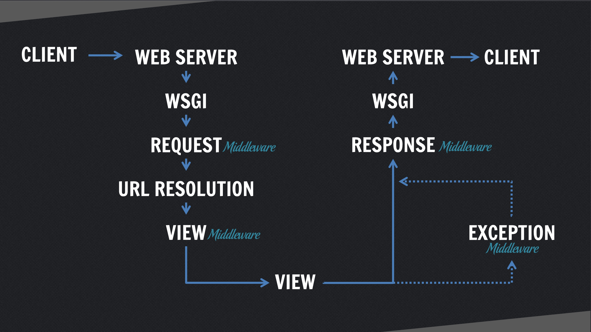

之前不知道在哪里看到过一题面试题说能不能说出Django处理一个请求的完整流程。我自己想了一下，居然也不能答上来。遂找了一张图，搭上代码，来做做笔记。

流程图如下：


无论是使用uwsgi还是使用django自带的runserver命令， 最终都会使用WSGIHandler（`django.core.wsgi.WSGIHandler`）作为处理请求的类，其中只定义了一个`__call__`方法，调用自身的get_response方法进行request处理。

`WSGIHandler.get_response`方法的注释简单明了，就是为request返回一个`HttpResponse`对象。
详细来看，由于`WSGIHandler.__call__`在一开始就load了settings中的middlware，并将其分成了以下几类(值得注意的是load middleware的顺序)：

1. request_middleware(带`process_request`方法)

2. view_middleware(带`process_view`方法)

3. exception_middleware(带`process_exception`方法)

4. template_response_middleware(带`process_template_response`方法)

5. response_middleware(带`process_response`方法)


接下来在`WSGIHandler.get_response` 中，按上面的顺序（1，2，3，4）把request传入各个middleware的对应方法(`middleware_method`)中撸一遍，如果任何一个`middleware_method`返回了一个非None对象，这个对象就会被传入`response_middleware`中进行response流程。当让response_middleware就不能返回None了。

这个过程中还有很多异常处理，暂且不提。
那么什么时候调用我们自己写的views？答案是在view_middleware处理完request之后，有一个

```python
response = wrapped_callback(request, *callback_args, **callback_kwargs)
```

来回调我们的view。当然在前面有url resolver解析出request对应的view了。在view处理的过程中如果有exception发生，就进入exception_middleware处理流程。
这样，整个处理请求的过程就清晰了。
